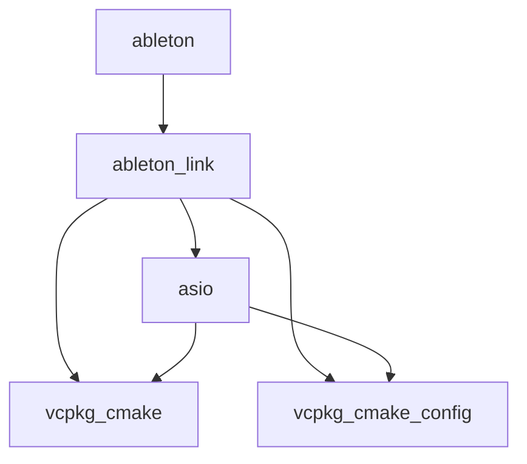

# vcpkg depend-info

## Synopsis

```no-highlight
vcpkg depend-info [options] <package>...
```

## Description

Display dependencies for a set of port packages.

`depend-info` displays all transitive dependencies for a set of packages in several formats, including  plain text, tree, DGML, DOT or Mermaid.
The set of packages is considered as a single combined request similar to `vcpkg install <package>...` but regardless of installed packages.

When used with multiple triplets (default, host, per-package), packages which are installed for other triplets than the default are marked.
Packages for the host triplet are marked with the suffix `:host`.

## Examples

#### List

```console
$ vcpkg depend-info ableton

vcpkg-cmake:
vcpkg-cmake-config:
asio: vcpkg-cmake, vcpkg-cmake-config
ableton-link: asio, vcpkg-cmake, vcpkg-cmake-config
ableton: ableton-link
```

#### Tree

```console
$ vcpkg depend-info ableton --format=tree

ableton
+-- ableton-link
    +-- asio
    |   +-- vcpkg-cmake
    |   +-- vcpkg-cmake-config
    +-- vcpkg-cmake
    +-- vcpkg-cmake-config
```

#### Dot

```console
$ vcpkg depend-info ableton --format=dot

digraph G{ rankdir=LR; node [fontname=Sans]; edge [minlen=3]; overlap=false;
"vcpkg-cmake";
"vcpkg-cmake-config";
"asio";
"asio" -> "vcpkg-cmake";
"asio" -> "vcpkg-cmake-config";
"ableton-link";
"ableton-link" -> "asio";
"ableton-link" -> "vcpkg-cmake";
"ableton-link" -> "vcpkg-cmake-config";
"ableton";
"ableton" -> "ableton-link";
"2 singletons...";
}
```

#### DGML

```console
$ vcpkg depend-info ableton --format=dgml

<?xml version="1.0" encoding="utf-8"?>
<DirectedGraph xmlns="http://schemas.microsoft.com/vs/2009/dgml">
    <Nodes>
        <Node Id="ableton"/>
        <Node Id="ableton-link"/>
        <Node Id="asio"/>
        <Node Id="vcpkg-cmake"/>
        <Node Id="vcpkg-cmake-config"/>
    </Nodes>
    <Links>
        <Link Source="ableton" Target="ableton-link"/>
        <Link Source="ableton-link" Target="asio"/>
        <Link Source="ableton-link" Target="vcpkg-cmake"/>
        <Link Source="ableton-link" Target="vcpkg-cmake-config"/>
        <Link Source="asio" Target="vcpkg-cmake"/>
        <Link Source="asio" Target="vcpkg-cmake-config"/>
    </Links>
</DirectedGraph>
```

#### Mermaid

```console
$ vcpkg depend-info ableton --format=mermaid

flowchart TD;
    ableton --> ableton-link;
    ableton-link --> asio;
    ableton-link --> vcpkg-cmake;
    ableton-link --> vcpkg-cmake-config;
    asio --> vcpkg-cmake;
    asio --> vcpkg-cmake-config;
```

#### Rendered diagram



#### Multiple triplets and packages

```console
$ ./vcpkg depend-info proj tiff[core] --triplet x64-windows-static-md

vcpkg-cmake:host: 
vcpkg-cmake-config:host: 
zlib: vcpkg-cmake:host
liblzma: vcpkg-cmake:host, vcpkg-cmake-config:host
curl[sspi, ssl, schannel, non-http]: vcpkg-cmake:host, vcpkg-cmake-config:host, zlib
nlohmann-json: vcpkg-cmake:host, vcpkg-cmake-config:host
sqlite3[json1, tool]:host: vcpkg-cmake:host, vcpkg-cmake-config:host
sqlite3[json1]: vcpkg-cmake:host, vcpkg-cmake-config:host
tiff[zip, lzma]: liblzma, vcpkg-cmake:host, vcpkg-cmake-config:host, zlib
proj[tiff, net]: curl, nlohmann-json, sqlite3:host, sqlite3, tiff, vcpkg-cmake:host, vcpkg-cmake-config:host
```

## Options

All vcpkg commands support a set of [common options](common-options.md).

### `--format=<format>`

#### `list`
The default format, prints a textual list.

#### `tree`
Prints a 'tree' similar to the console command `tree`.

#### `dot`
Generate the dependency tree in the [DOT](https://en.wikipedia.org/wiki/DOT_(graph_description_language)) graph description format.

#### `dgml`
Generate the dependency tree in the [DGML (Directed Graph Markup Language)](https://en.wikipedia.org/wiki/DGML) XML format.

#### `mermaid`
Generate the dependency tree in the [Mermaid](https://mermaid.js.org/intro/) diagram syntax format.

### `--show-depth`
Show recursion depth in output.

Only accepted for list and tree formats.

### `--max-recurse=<depth>`
Set maximum depth to display.

A value of -1 indicates no limit.

### `--sort=<type>`
Set sort order for the list of dependencies.

Only accepted for list format.

Sorting Options:

- `lexicographical` - Sort by name
- `topological` - (Default) Sort by increasing depth
- `reverse` - Sort by decreasing depth
