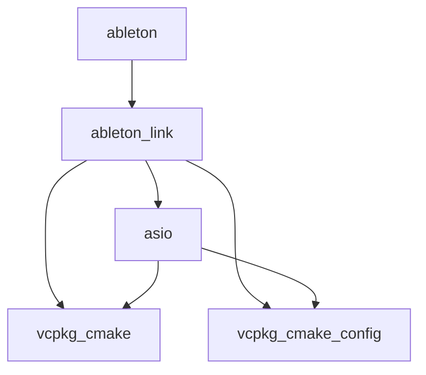

# vcpkg depend-info

## Synopsis

```no-highlight
vcpkg depend-info [options] <package>
```

## Description

Display all dependencies for a package.

`depend-info` displays all transitive dependencies for a package in several formats, including a plain text list, DGML, or DOT.

## Examples

#### List
```console
$ vcpkg depend-info ableton

vcpkg-cmake:
vcpkg-cmake-config:
asio: vcpkg-cmake, vcpkg-cmake-config
ableton-link: asio, vcpkg-cmake, vcpkg-cmake-config
ableton: ableton-link
```

#### DGML
```console
$ vcpkg depend-info ableton --dgml

<?xml version="1.0" encoding="utf-8"?>
<DirectedGraph xmlns="http://schemas.microsoft.com/vs/2009/dgml">
    <Nodes>
        <Node Id="ableton"/>
        <Node Id="ableton-link"/>
        <Node Id="asio"/>
        <Node Id="vcpkg-cmake"/>
        <Node Id="vcpkg-cmake-config"/>
    </Nodes>
    <Links>
        <Link Source="ableton" Target="ableton-link"/>
        <Link Source="ableton-link" Target="asio"/>
        <Link Source="ableton-link" Target="vcpkg-cmake"/>
        <Link Source="ableton-link" Target="vcpkg-cmake-config"/>
        <Link Source="asio" Target="vcpkg-cmake"/>
        <Link Source="asio" Target="vcpkg-cmake-config"/>
    </Links>
</DirectedGraph>
```

#### DOT
```console
$ vcpkg depend-info ableton --dot

digraph G{
    rankdir=LR;
    edge [minlen=3];
    overlap=false;
    ableton;
    ableton -> ableton_link;
    ableton_link;
    ableton_link -> asio;
    ableton_link -> vcpkg_cmake;
    ableton_link -> vcpkg_cmake_config;
    asio;
    asio -> vcpkg_cmake;
    asio -> vcpkg_cmake_config;
    empty [label="2 singletons..."];
}
```

#### Rendered diagram


## Options

All vcpkg commands support a set of [common options](common-options.md).

### `--dot`
Generate the dependency tree in the [DOT](https://en.wikipedia.org/wiki/DOT_(graph_description_language)) graph description format.

### `--dgml`
Generate the dependency tree in the [DGML (Directed Graph Markup Language)](https://en.wikipedia.org/wiki/DGML) XML format.

### `--show-depth`
Show recursion depth in output.

Only applies to plain text list output.

### `--max-recurse=<depth>`
Set maximum depth to display.

A value of -1 indicates no limit.

### `--sort=<type>`
Set sort order for the list of dependencies.

Only applies to plain text list output.

Sorting Options:

- `lexicographical` - Sort by name
- `topological` - (Default) Sort by increasing depth
- `reverse` - Sort by decreasing depth
- `x-tree` - (Experimental) Display an ASCII-art tree

## Options

All vcpkg commands support a set of [common options](common-options.md).
