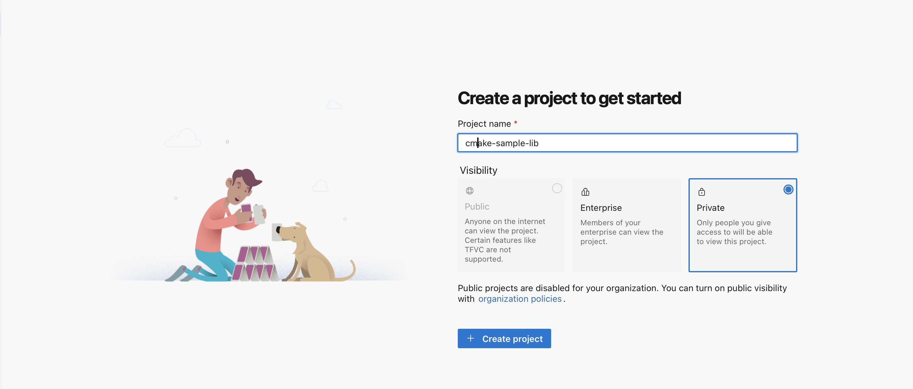
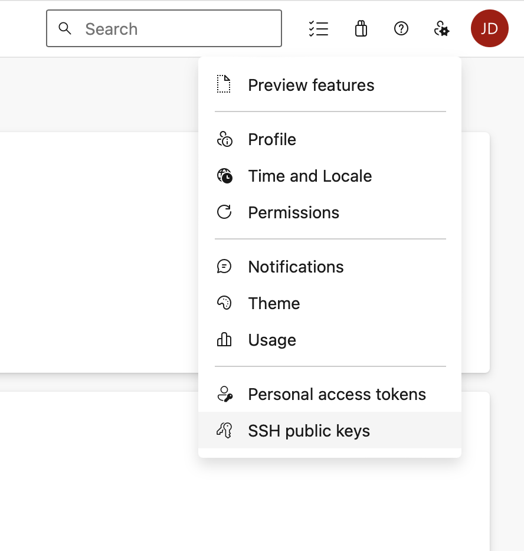
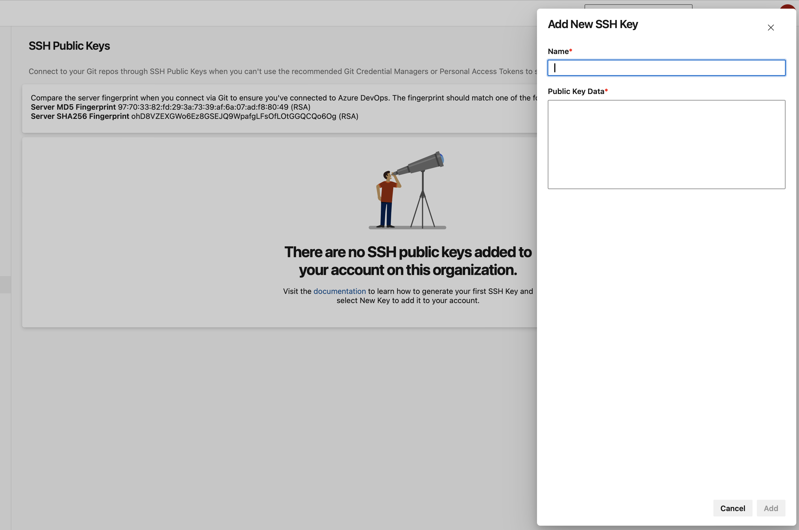
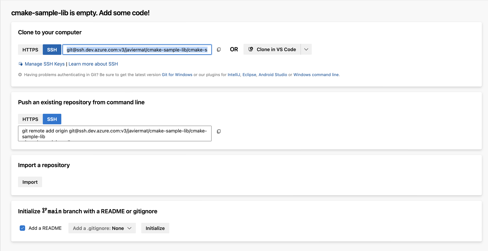

# Tutorial: Package a private Azure DevOps dependency

TODO: add 2 to three sentences about what the article will walk you through

## Prerequisites:

- Basic understanding of Git and vcpkg.
- Access to Azure DevOps with permissions to create projects and manage SSH keys.
- `vcpkg` installed on your system.
- Git installed on your system.

## 1 - Create a private project

1. Log into your Azure DevOps account
2. Create a new private project. If you don't have an organization, you'll be prompted to create one during the project creation process.
    - **Name your project**: Choose a meaningful name that reflects your library or its purpose.
    - **Visibility**: Ensure the project is set to "Private" to control access.

        


## 2 - Set Up Authentication in Azure DevOps

Secure access to your repository with SSH keys.

1. Generate an SSH Key Pair

    - Open a terminal or command prompt.
    - Run the following command:

        ```console
        ssh-keygen -t rsa -b 4096 -C "ADO-RSA" -f /path/to/.ssh/id_rsa_ado
        ```

        - `-t rsa`: Specifies the type of key to create, in this case, RSA.
        - `-b 4096`: Sets the number of bits in the key, in this case, 4096, which is considered strong and secure.
        - `-C "ADO-RSA"`: Adds a label to the key for identification, which can be particularly useful when you have multiple keys.
        - `-f /path/to/.ssh/id_rsa_ado`: Specifies the filename for the new key. This command saves the private key to `id_rsa_ado` and the public key to `id_rsa_ado.pub`.

        You'll be prompted to enter a passphrase for additional security. You can either enter a passphrase or press Enter to proceed without one. A passphrase adds an extra layer of security by requiring the passphrase to be entered whenever the key is used.

    - After the key generation, confirm the new key is created by listing the contents of your `/.ssh/` directory again:
        ```console
        ls /path/to/.ssh
        ```

2. Add your SSH key to Azure DevOps
    - Open the `id_rsa_ado.pub` file with a text editor to view the public key.
    - Copy the entire content of the file.
    - Navigate to your **User Settings > SSH Public Keys**.

        

    - Add your new key by pasting the copied content and name your key for future reference.

        

3. Load your SSH key into the SSH agent.

    Ensure your SSH key is available for authentication:

    ```console
    ssh-add /path/to/.ssh/id_rsa_ado
    ```

4. Test SSH connection

    Verify connectivity to Azure DevOps:

    ```console
    ssh -T git@ssh.dev.azure.com
    ```

    Expect a message indicating successful authentication but noting that shell access is not supported.

    ```
    ssh -T git@ssh.dev.azure.com
    remote: Shell access is not supported.
    shell request failed on channel 0
    ```
    
## 3 - Upload library to Azure DevOps repo

1. Initialize a local git repository
    
    Navigate to your library's source code directory and initialize a Git repository:

    ```console
    git init
    ```

2. Commit your library
    Add and commit your library's source code:

    ```console
    git add .
    git commit -m "Initial commit of the sample library"
    ```

3. Link to Your Azure DevOps Repository

    Retrieve your repository's SSH URL from Azure DevOps and add it as a remote:

    

    ```console
    git remote add origin <Your-Repo-SSH-URL>
    ```

4. Push Your Library

    Upload your library to the Azure DevOps repository:

    ```console
    git push -u origin master:main
    ```

## 4 - Package your library into an overlay port

[Overlay ports](../concepts/overlay-ports.md) allow you to use local ports with vcpkg.

1. Create an overlay ports directory

    ```console
    mkdir vcpkg-overlay-ports
    cd vcpkg-overlay-ports
    ```

2. Set up the port files

- `vcpkg.json`: This manifest file defines your library's metadata and dependencies.

    **Disclaimer**: The following examples use placeholders. Replace them with your actual data.

    ```json
    {
        "name": "your-library-name",
        "version": "1.0.0",
        "description": "Description of your library.",
        "dependencies": []
    }
    ```

    The `vcpkg.json` file serves as a manifest that defines metadata and dependencies for a C++ library, providing vcpkg with the necessary information to build, install, and manage the package.

    - `name`: Specifies the name of the library. This is used as the package identifier.
    - `version`: Indicates the version number of the library.
    - `description`: Brief text describing what the library does. This is for documentation and users.
    - `dependencies`: An array containing the list of dependencies that the library needs.

    For more information on how to set up your `vcpkg.json`, check out our [reference documentation](../reference/vcpkg-json.md).

- `portfile.cmake` : This script tells vcpkg how to build your library.
    ```cmake
    vcpkg_from_git(
        OUT_SOURCE_PATH SOURCE_PATH
        URL "git@ssh.dev.azure.com:v3/YourOrg/YourProject/YourRepo"
        REF "<commit-sha>"
    )

    vcpkg_cmake_configure(SOURCE_PATH "${SOURCE_PATH}")
    vcpkg_cmake_install()
    vcpkg_cmake_config_fixup(PACKAGE_NAME your-library-name)
    file(INSTALL "${SOURCE_PATH}/LICENSE" DESTINATION "${CURRENT_PACKAGES_DIR}/share/your-library-name")
    ```

    This portfile defines how to download, build, install, and package a specific C++ library from GitHub using vcpkg.

    - `vcpkg_from_git`: Starts the function to download the source code from a git repository.
    - `OUT_SOURCE_PATH SOURCE_PATH`: Sets the directory where the source code will be extracted.
    - `URL git@ssh.dev.azure.com:v3/YourOrg/YourProject/YourRepo`: The SSH URL for the repository containing the source code.
    - `REF <commit-sha>`: The commit SHA of your library's code in Azure DevOps.
    - `vcpkg_cmake_configure`: Configures the project using CMake, setting up the build.
        -  `SOURCE_PATH "${SOURCE_PATH}"`: The path to the source code downloaded earlier.
    - `vcpkg_cmake_install()`: Builds and installs the package using CMake.
    - `vcpkg_cmake_config_fixup(PACKAGE_NAME your-library-name)`: Fixes the CMake package configuration files to be compatible with Vcpkg.
    - `file(INSTALL "${SOURCE_PATH}/LICENSE" DESTINATION ...)`: Installs the LICENSE file to the package's share directory and renames it to copyright.

    To obtain the commit SHA:

    ```console
    mkdir temp && cd temp
    git init
    git fetch <Your-Repo-SSH-URL> main --depth 1 -n
    git rev-parse FETCH_HEAD
    ```

    For more information on how to set up your `portfile.cmake`,  checkout the following articles:
    - [Ports concepts](../concepts/ports.md)
    - [Overlay Ports](../concepts/overlay-ports.md)
    - [vcpkg_from_git](../maintainers/functions/vcpkg_from_git.md)
    - [Portfile Variables](../maintainers/variables.md)
    - [Triplets](../users/triplets.md)

3. Install your port

    Back in your main vcpkg directory, install your library specifying the overlay ports directory:

    ```console
    vcpkg install your-library-name --overlay-ports=/path/to/vcpkg-overlay-ports
    ```

## Next Steps

You've successfully packaged a private Azure DevOps repository as a vcpkg port. This tutorial is intended as a guideline; please adapt the instructions to fit your specific library and development environment.
